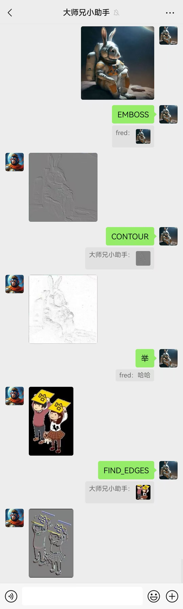
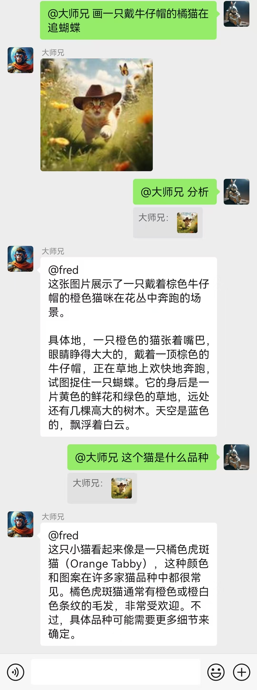
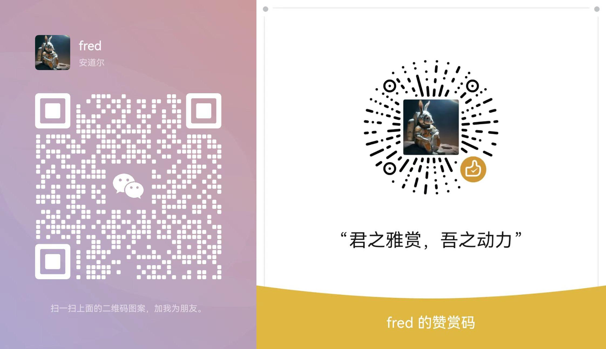

# plugin_ref

## 简介

一个极简的概念验证 demo([dify-on-wechat](https://github.com/hanfangyuan4396/dify-on-wechat)插件)，支持引用文本或图片的交互方式。

|||||

## 安装

- clone 或下载本仓库源代码到[dify-on-wechat](https://github.com/hanfangyuan4396/dify-on-wechat)的 plugins 文件夹中
- 启动 dify-on-wechat，即可自动加载并启用本插件

### 基于[godcmd 插件](https://github.com/hanfangyuan4396/dify-on-wechat/tree/master/plugins/godcmd)安装

- `#auth <口令>`
- `#installp https://github.com/WoodGoose/plugin_ref.git`
- `#scanp`

## 功能

- 举、举牌: 以引用文字为输入生成小人举牌图片
- `BLUR、CONTOUR、DETAIL、EDGE_ENHANCE、EDGE_ENHANCE_MORE、EMBOSS、FIND_EDGES、SHARPEN、SMOOTH、SMOOTH_MORE`：以引用图片为输入做简单图片处理
- "分析"或任意文字：以引用图片为输入调用智谱的视觉理解模型(GLM-4V-Flash)
- 下载：下载引用表情，支持图片与 gif
- 画：基于智谱 cogview-3-flash 的文生图

## 配置

部分功能需要配置智谱的 api key，请参考 config.json.template 创建 config.json 来配置 zhipu_api_key。

## 其他

- 仅支持[Gewechat](https://github.com/hanfangyuan4396/dify-on-wechat/blob/master/docs/gewechat/README.md)通道。
- 需要更新 [DoW](https://github.com/hanfangyuan4396/dify-on-wechat) 的代码，确保带上[一些相关的改动](https://github.com/hanfangyuan4396/dify-on-wechat/pull/248)。
- 更多[CoW](https://github.com/zhayujie/chatgpt-on-wechat)或[DoW](https://github.com/hanfangyuan4396/dify-on-wechat)插件请看 [awesome-cow-plugins](https://github.com/WoodGoose/awesome-cow-plugins)，欢迎加入"CoW 插件交流群"。
- 任何想法、建议、需求、咨询等，欢迎加微信交流：fred2025，备注 ref。

